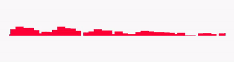
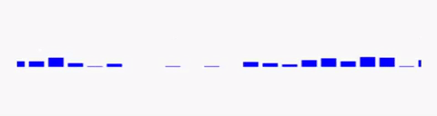
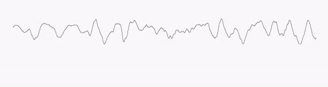
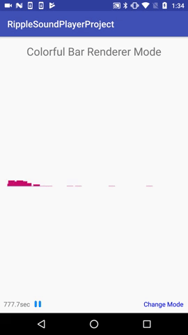

# Droid-vizu
 

# About
[]() 
[]() 
[]()

Droid-vizu aims to provide cool with visualization effects for any Android audio project. The modular design allows users to easily swap Renderer class to get corresponding effects.

# Demo
[]()


# Implement
```gradle
repositories {
  jcenter()
}

dependencies {
  compile 'info.kimjihyok:ripple-sound-player:${ripple-sound-player-version}'
}
```

## XML Setup
```XML
    <!-- Vizualizer -->
    <info.kimjihyok.ripplesoundplayer.RippleVisualizerView
        android:id="@+id/renderer_demo"
        android:layout_margin="16dp"
        android:layout_width="match_parent"
        android:layout_height="50dp"/>
        
    <!-- Sample Player -->
    <info.kimjihyok.ripplesoundplayer.SoundPlayerView
        android:id="@+id/sound_player_view"
        android:layout_width="match_parent"
        android:layout_height="wrap_content"
        android:layout_alignParentBottom="true"/>    
```

## Code Usage
```java
    MediaPlayer mediaPlayer = MediaPlayer.create(getApplicationContext(), R.raw.sound_file);  // or any other way to initialize media player are prepare()
    soundPlayerView = (SoundPlayerView) findViewById(R.id.sound_player_view);
    soundPlayerView.setMediaPlayer(mediaPlayer);
    soundPlayerView.setPlayStopListener(new SoundPlayerView.OnMediaControlListener() {
        @Override
        public void onPlay() {
          renderDemoView.play();
        }

        @Override
        public void onStop() {
          renderDemoView.stop();
        }
      });
      
    renderDemoView = (RippleVisualizerView) findViewById(R.id.renderer_demo);
    renderDemoView.setMediaPlayer(mediaPlayer);
    renderDemoView.setCurrentRenderer(renderer);
```

## Renderer Information
Detailed information about parameters could be found in the source code! 

### ColorBarRenderer
[]() 
```java
  renderDemoView.setCurrentRenderer(new ColorfulBarRenderer(8, PaintUtil.getBarGraphPaint(Color.BLUE)
            , Color.parseColor("#FF0033")
            , Color.parseColor("#801AB3"))
```

### BarRenderer
[]() 
```java
  new BarRenderer(16, PaintUtil.getBarGraphPaint(Color.BLUE));
```

### LineRenderer
[]() 
```java
  new LineRenderer(PaintUtil.getLinePaint(Color.BLACK));
```


## Stop and Destory
```java
// It is required to stop VoiceRippleView at onStop and to destory at onDestory to prevent memory leak and unexpected
@Override
protected void onStop() {
  super.onStop();
  soundPlayerView.onStop();
  renderDemoView.stop();
}
 
@Override
protected void onDestroy() {
  super.onDestroy();
  soundPlayerView.onDestroy();
  renderDemoView.destroy();
}
```
